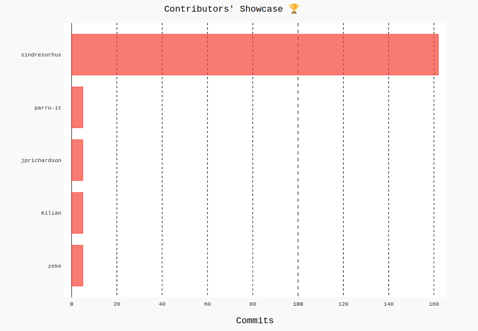

<h1 align="center">
    Contributors' Showcase 🏆
</h1>
<p align="center">
  Express gratitude to the contributors by adding their showcase on your project
</p>
<p align="center">
  <a href="https://github.com/wweverma1/contributors-showcase/fork" target="blank">
    
  </a>
  <a href="https://github.com/wweverma1/contributors-showcase/stargazers" target="blank">
    
  </a>
  <a href="https://github.com/wweverma1/contributors-showcase/issues" target="blank">
    
  </a>
</p>
<p align="center">
  <a href="#demo">View Demo</a>
  ·
  <a href="https://github.com/wweverma1/contributors-showcase/issues/new/choose">Report Bug</a>
  ·
  <a href="#contributing">Contribute</a>
</p>

## 🌟 About

This project offers you a new add-on i.e. **Contributor's Showcase** to add to your GitHub Projects.

## Demo



<!-- ## 🧐 Features -->

## 🛠️ Usage

Copy-paste this code into your project's GitHub Readme.

```md
### Contributors' Showcase 🏆

<a href="https://github.com/wweverma1/contributors-showcase"></a>
```

#### Parameters:

- `owner` - username of the project owner
- `repository` - name of the project repository
- `limit` - number of contributors to showcase

Default `limit` parameter is `5`.

## Contributing

If you're interested in contributing to this project please pick an [Open Issue](https://github.com/wweverma1/contributors-showcase/issues?q=is%3Aopen+is%3Aissue) or create a new one.

Also, please follow the [GitHub Flow](https://guides.github.com/introduction/flow). Create a branch, add commits, and open a pull request.
Thanks!

## 🙏 Special Thanks

- [GitHub](https://github.com/) for their [APIs](https://docs.github.com/en/rest)
- [pygal](https://www.pygal.org/en/stable/index.html)

<hr>
<p align="center">
Developed with ❤️ in India 🇮🇳 
</p>

